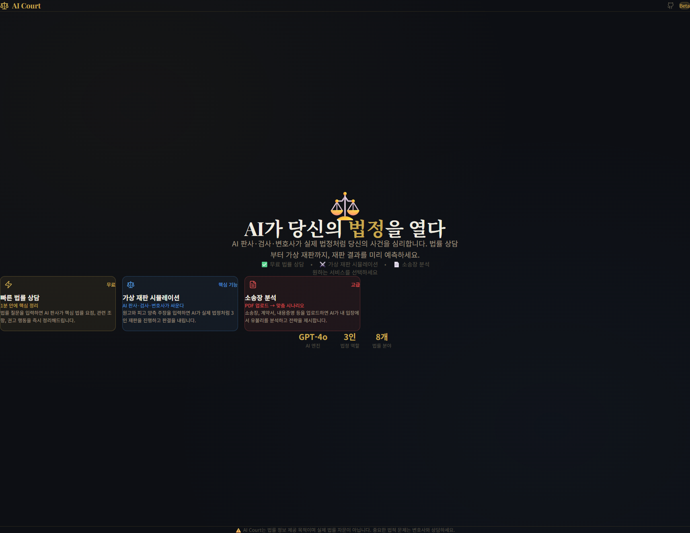
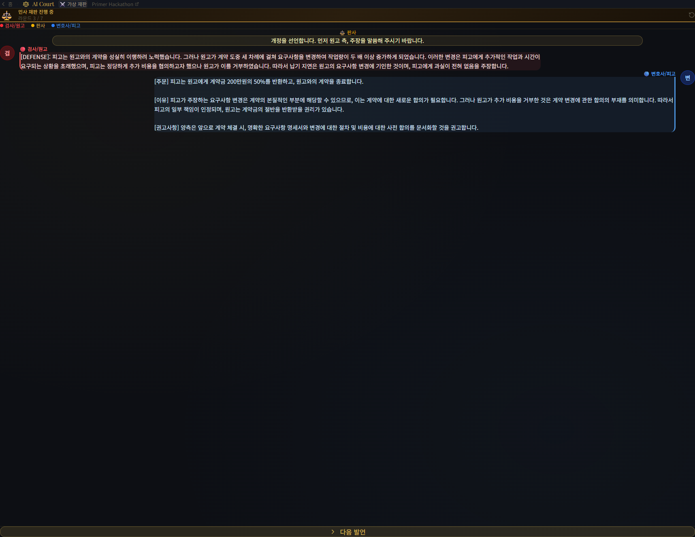
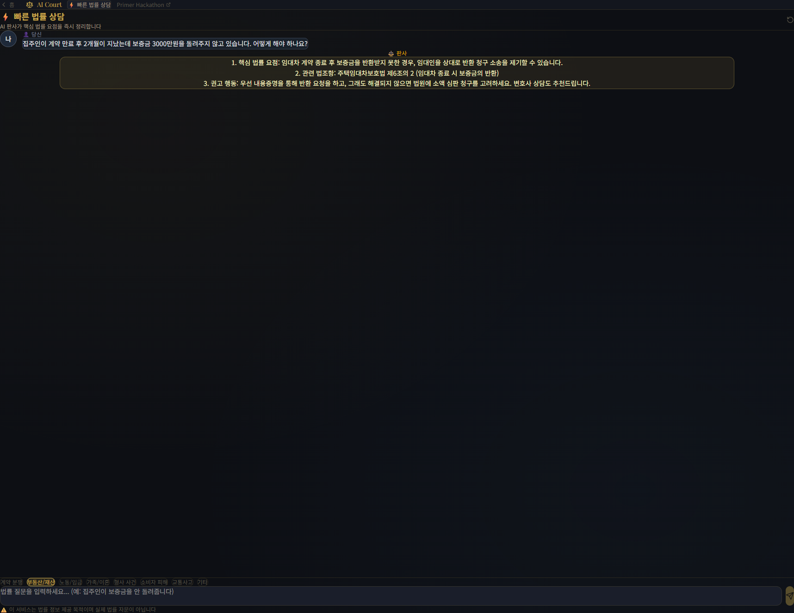

# ⚖️ AI Court


> **"당신만의 AI 법률 파트너"** — 복잡한 법적 분쟁, AI가 판사·검사·변호사가 되어 미리 시뮬레이션해 드립니다.

[](https://ai-court.pages.dev)
[](https://github.com/Hwani-Net/ai-court)

## ✨ AI Court가 특별한 이유

단순한 챗봇이 아닙니다. **실제 법정의 메커니즘**을 그대로 담았습니다.

- **⚖️ 3인 법정 시스템**: 판사만 답변하는 것이 아니라, 공격(검사)과 방어(변호사)의 치열한 공방을 거쳐 최종 판결이 도출됩니다.
- **📄 스마트 문서 분석**: 업로드한 소송장이나 계약서의 텍스트를 AI가 이해하고 유리한 점과 불리한 점을 전략적으로 분석합니다.
- **🖼️ 고품질 비주얼**: 판결문 형식(`[주문]`, `[이유]`, `[권고사항]`)으로 구조화된 결과물을 프리미엄 골드 카드로 제공합니다.

---

## 🚀 주요 기능

### 1. ⚡ 빠른 법률 상담
질문 한 번으로 핵심 법적 쟁점을 즉시 파악하세요. GPT-4o가 대한민국 법리를 분석하여 일목요연하게 정리해 드립니다.

### 2. ⚔️ 가상 재판 시뮬레이션
7라운드에 걸친 3인 AI의 설전! 원고와 피고의 주장을 입력하면 실제 재판과 유사한 흐름으로 공방이 오가고 판사가 최종 판결을 내립니다.

### 3. 📄 소송장 분석
소송장, 내용증명, 계약서 등을 업로드(PDF/TXT) 하세요. AI가 ${userSide} 입장에서 최적의 대응 시나리오를 제시합니다.

---

## 🛠 Tech Stack

- **Core**: React, TypeScript, Vite
- **Styling**: Tailwind CSS v4, Framer Motion
- **AI**: OpenAI GPT-4o (Streaming Response)
- **Deployment**: Cloudflare Pages & Functions
- **Integrations**: Kakao Share, GA4, pdf.js

---

## 📸 Screenshots

| 메인 랜딩 | 재판 진행 | 판결 결과 |
| :---: | :---: | :---: |
|  |  |  |

---

## 📦 설치 및 실행

```bash
# 레포지토리 클론
git clone https://github.com/Hwani-Net/ai-court.git

# 의존성 설치
npm install

# 환경변수 설정 (.env.local)
VITE_OPENAI_API_KEY=your_api_key_here

# 개발 서버 실행
npm run dev
```

---

## ⚖️ Disclaimer
AI Court는 법률 정보를 제공하는 도구일 뿐, 실제 법적 효력을 갖는 자문이 아닙니다. 법률적 판단이 필요한 경우에는 반드시 전문 법조인의 도움을 받으시기 바랍니다.

---
© 2024 AI Court Team. All rights reserved.
